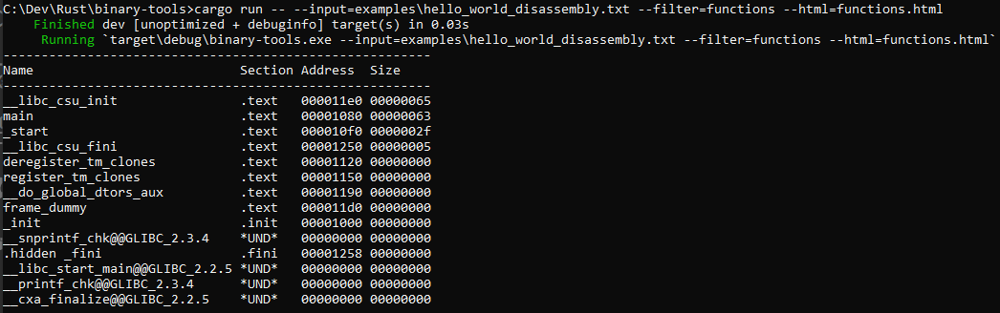
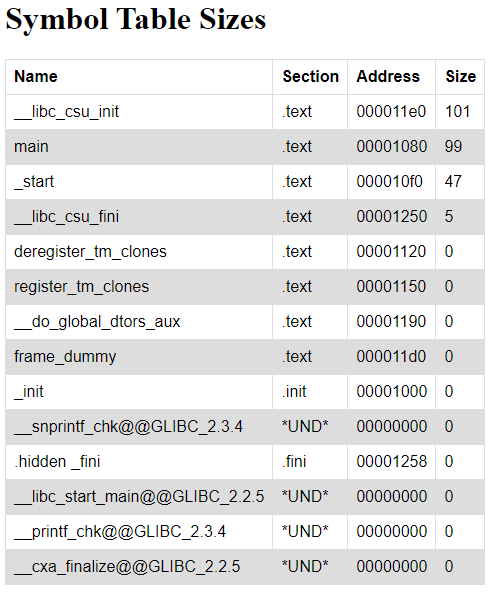

<div id="top"></div>

<!-- PROJECT LOGO -->
<br />
<div align="center">
  <h1 align="center">Binary Utilities</h1>

  <p align="center">
    A set of command line tools for parsing and viewing binary executable data (symbol tables, etc.) for optimizing program size, memory usage, and performance!
    <br />
    <a href="https://github.com/graham-riches/binary-tools/issues">Report Bug</a>
    ·
    <a href="https://github.com/graham-riches/binary-tools/issues">Request Feature</a>
  </p>
</div>


<!-- TABLE OF CONTENTS -->
<details>
  <summary>Table of Contents</summary>
  <ol>
    <li>
      <a href="#about-the-project">About The Project</a>
      <ul>
        <li><a href="#built-with">Built With</a></li>
      </ul>
    </li>
    <li>
      <a href="#getting-started">Getting Started</a>
      <ul>
        <li><a href="#installation">Installation</a></li>
      </ul>
    </li>
    <li>
        <a href="#usage">Usage</a>
        <ul>
            <li><a href="#usage-from-file">Usage from File</a></li>
            <li><a href="#usage-from-pipes">Usage from Pipes</a></li>
            <li><a href="#filtering-the-symbol-table">Filtering the Symbol Table</a></li>
            <li><a href="#creating-html-output">Creating HTML Output</a></li>
        </ul>
    </li>
    <li><a href="#contributing">Contributing</a></li>
    <li><a href="#license">License</a></li>
  </ol>
</details>


## About The Project

Program size and memory usage is an important facet of your project to monitor, particulary for resource constrained embedded systems where limited
flash and RAM are available. Optimizing the size and memory usage of your program can sometimes be the difference between running out of memory, or adding
that fancy new feature to your project! This project is designed to provide some tools that make parsing and viewing program disassembly output more palatable
by being able to filter, sort and view symbol table output into structured tables, which can be used to find the largest functions or objects in your program
that are hogging critical resources!

**NOTE: The project currently only supports parsing symbol table output from `objdump`, which can be generated via: `objdump -d -t <executable>`**


### Sample CLI Output of Function Sizes


### Sample HTML Output



<p align="right">(<a href="#top">back to top</a>)</p>


### Built With

This project is built using Rust with a few great open source crates:

* [Nom](https://docs.rs/nom/7.0.0/nom/)
* [Clap](https://docs.rs/clap/2.33.3/clap/)
* [Horrorshow](https://docs.rs/horrorshow/0.8.4/horrorshow/)

<p align="right">(<a href="#top">back to top</a>)</p>


## Getting Started

To build the project locally, follow the steps below. If you have not previously installed Rust on your system, follow the instructions [here](https://www.rust-lang.org/tools/install).


### Installation

1. Clone the repo: `git clone git@github.com:graham-riches/binary-tools.git`
2. Build using Cargo: `cargo build --release`
3. Add the `target/release` folder to your `PATH`

<p align="right">(<a href="#top">back to top</a>)</p>


## Usage

### Usage from File
To run the tool on a pregenerated objdump output, the `--input=<input_file>` CLI argument is required to specify the path of the file being parsed:
```
binary-tools --input=filename.txt
```

### Usage from Pipes
To run the program with input piped from another utility:
```
objdump -d -t examples/build/hello_world | binary-tools
```

### Filtering the Symbol Table
The symbol table can be filtered to only display objects, functions, or files using the `--filter=<filter option>` CLI option
```
objdump -d -t examples/build/hello_world | binary-tools --filter=functions
```

### Creating HTML Output
If the `--html=filename.html` CLI option is present, the program will output the symbol table as a static HTML file with `filename.html`:
```
objdump -d -t examples/build/hello_world | binary-tools --filter=functions --html=functions.html
```

<p align="right">(<a href="#top">back to top</a>)</p>


## Contributing

Any contributions are welcome! Please feel free to submit and new features or fixes through a pull request!

1. Fork the Project
2. Create your Feature Branch (`git checkout -b feature/AmazingFeature`)
3. Commit your Changes (`git commit -m 'Add some AmazingFeature'`)
4. Push to the Branch (`git push origin feature/AmazingFeature`)
5. Open a Pull Request

<p align="right">(<a href="#top">back to top</a>)</p>


<!-- LICENSE -->
## License

Distributed under the MIT License. See `LICENSE` for more information.

<p align="right">(<a href="#top">back to top</a>)</p>
